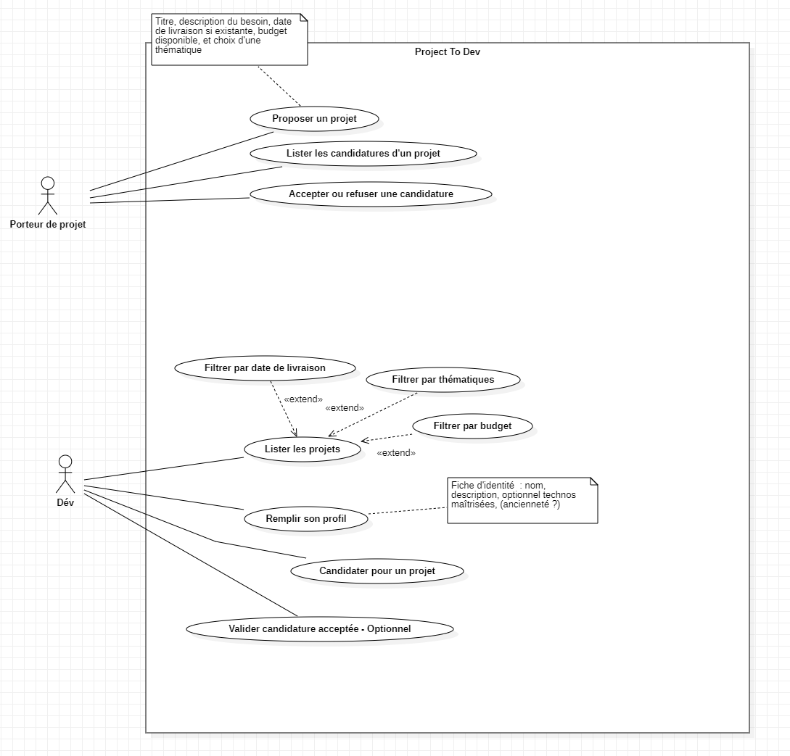

# project-to-dev

## Description

Projet de mise de en relation entre des dev et des porteurs de projets

## USECASE



## UML


## Installation

```bash
# Instructions d'installation
git clone https://github.com/AnaelTech/project-to-dev.git
```

## Utilisation

```bash
# Exemples d'utilisation
mvn clean install
mvn exec:java
```

> [!TIP]
>
> Pour connecter le projet à un serveur MySQL, il faut récupérer la structure du fichier `persistence-example.xml` à la racine du projet.  
> Ensuite, créer un fichier `persistence.xml` qui contiendra les informations de connexion à la base de données.

## Contribution

Les contributions sont les bienvenues ! N'hésitez pas à :

1. Fork le projet
2. Créer une branche pour votre fonctionnalité
3. Commit vos changements
4. Push vers la branche
5. Ouvrir une Pull Request

## Licence

Ce projet est sous licence [MIT](LICENSE).

---

> Généré avec le script GitHub Repository Creator
